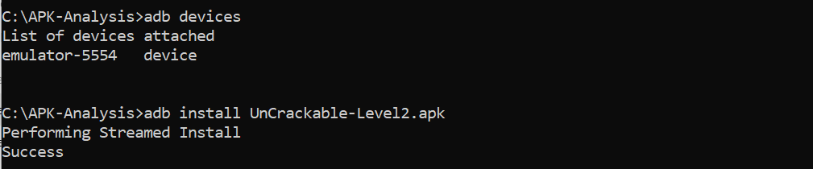
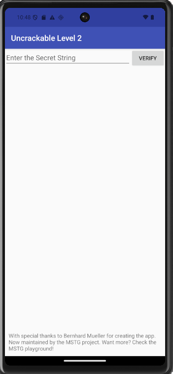
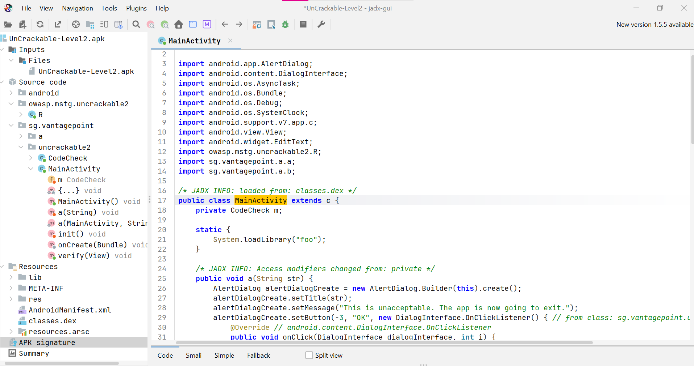
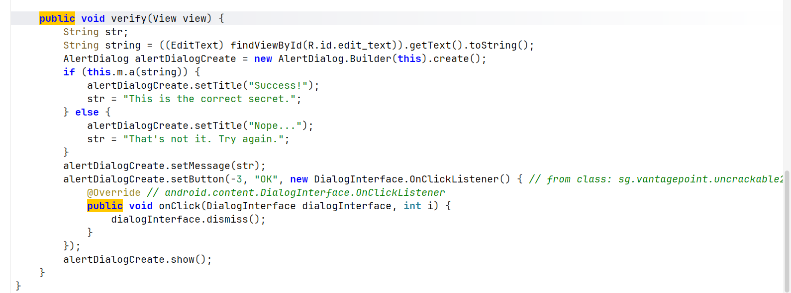
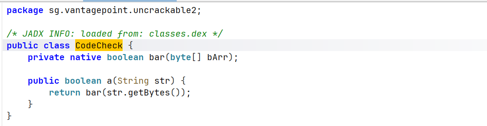
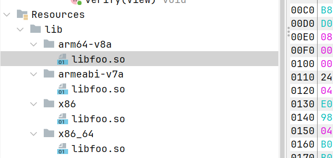
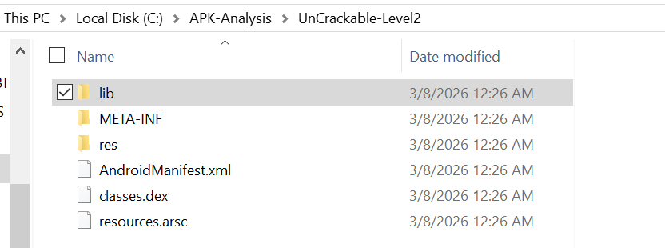
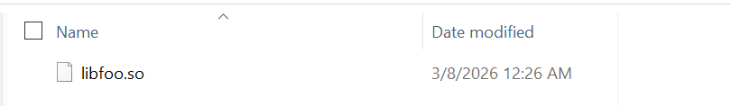
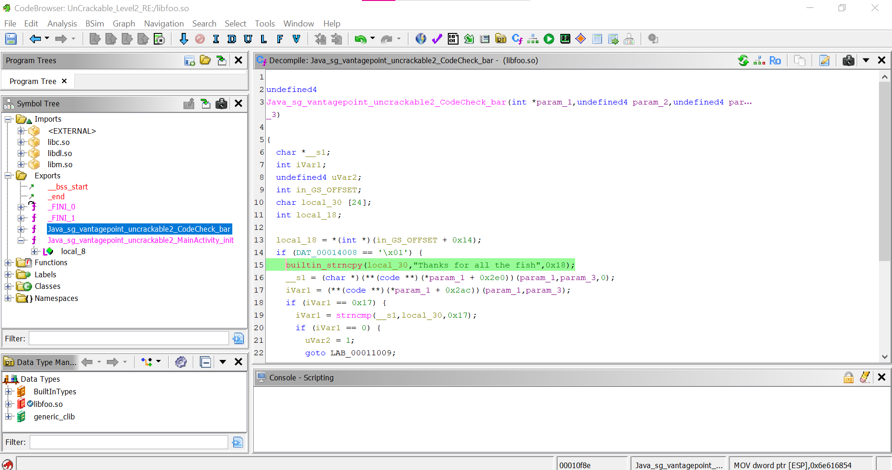
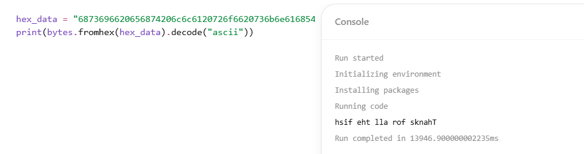

# Reverse Engineering Android — UnCrackable Level 2

## Présentation du laboratoire

Ce laboratoire se concentre sur le reverse engineering d’une application Android qui cache sa logique de vérification principale dans une bibliothèque native.

L’application semble initialement simple : elle propose un champ de texte permettant à l’utilisateur de saisir une chaîne de caractères et un bouton qui vérifie si la valeur saisie est correcte.

Cependant, la logique de validation n’est pas entièrement implémentée en Java. L’application charge une bibliothèque native (.so) via JNI, et la comparaison réelle est effectuée dans du code natif.

L’objectif de ce laboratoire est de :

- analyser l’APK Android
- localiser où commence la validation
- identifier la bibliothèque native
- faire du reverse engineering de la fonction native
- récupérer la valeur secrète cachée
- valider cette valeur dans l’application

---

# Objectifs pédagogiques

Après avoir terminé ce laboratoire, vous devriez être capable de :

- Comprendre la structure d’un APK Android
- Effectuer une analyse statique d’un APK avec JADX
- Identifier quand du code Java appelle du code natif via JNI
- Localiser les bibliothèques natives dans un APK
- Faire du reverse engineering de binaires natifs avec Ghidra
- Identifier des comparaisons de chaînes dans du code natif
- Extraire des valeurs cachées dans des binaires compilés

---

# Environnement

| Composant | Valeur |
|-----------|--------|
| Système d'exploitation | Windows 10 |
| Émulateur | Pixel 6 |
| Application cible | UnCrackable Level 2 |
| Outils utilisés | ADB, JADX, Ghidra |
| Fichier APK | UnCrackable-Level2.apk |

---

# Étape 1 — Installation et lancement de l’APK

La première étape consiste à installer l’APK et observer le comportement de l’application.

## Commandes

```
adb devices
adb install UnCrackable-Level2.apk
```



L’application affiche une interface simple contenant :

- un champ de saisie
- un bouton VERIFY

À ce stade, l’objectif est simplement de comprendre le comportement visible de l’application avant d’analyser le code.

---

# Étape 2 — Test d’entrées invalides

Avant l’analyse du code, plusieurs valeurs ont été testées :

```
test
1234
hello
android
```

Chaque tentative produit le message d’erreur suivant :

```
Nope...
That's not it. Try again.
```


Cela confirme que l’application compare l’entrée utilisateur avec une valeur cachée.

---

# Étape 3 — Analyse statique avec JADX

L’APK a été ouvert avec JADX, un décompilateur permettant de convertir le bytecode Android en code Java lisible.

## Commande

```
jadx-gui UnCrackable-Level2.apk
```



Le package principal identifié est :

```
sg.vantagepoint.uncrackable2
```

Les classes principales sont :

- MainActivity
- CodeCheck

---

# Étape 4 — Identification du point d’entrée de la vérification

Dans la classe MainActivity, la méthode responsable de la vérification est :


```
verify(View view)
```

Cette fonction récupère l’entrée utilisateur :

```java
String string = ((EditText) findViewById(R.id.edit_text)).getText().toString();
```

La valeur est ensuite envoyée à la classe CodeCheck :

```java
if (this.m.a(string))
```

Flux d’exécution identifié :

```
Entrée utilisateur
↓
MainActivity.verify()
↓
CodeCheck.a()
```

---

# Étape 5 — Analyse de la classe CodeCheck

La classe CodeCheck contient l’implémentation suivante :


```java
public class CodeCheck {

    private native boolean bar(byte[] bArr);

    public boolean a(String str) {
        return bar(str.getBytes());
    }
}
```

Le mot-clé **native** indique que la fonction est implémentée en code natif plutôt qu’en Java.

Le flux d’exécution devient alors :

```
Entrée utilisateur
↓
MainActivity.verify()
↓
CodeCheck.a()
↓
CodeCheck.bar()  (méthode native)
↓
libfoo.so
```

---

# Étape 6 — Localisation de la bibliothèque native

L’application charge une bibliothèque native avec :

```java
System.loadLibrary("foo");
```

Cela correspond au fichier :

```
libfoo.so
```

Dans l’APK, les bibliothèques natives se trouvent dans :

```
lib/<architecture>/
```


Captures d’écran attendues :





---

# Étape 7 — Analyse de la bibliothèque native avec Ghidra

Le fichier **libfoo.so** a été importé dans Ghidra.

Après l’analyse automatique, la fonction JNI exportée a été localisée :

```
Java_sg_vantagepoint_uncrackable2_CodeCheck_bar
```

Captures d’écran attendues :



---

# Étape 8 — Identification de la comparaison de chaînes

Une fois la fonction JNI localisée dans Ghidra, l’étape suivante consiste à analyser ce que la fonction fait avec l’entrée utilisateur.

L’objectif n’est pas de comprendre chaque instruction du programme, mais d’identifier l’opération de comparaison critique.

---

## Action

Ouvrir la vue **Decompiler** dans Ghidra et rechercher les appels à la fonction :

```
strncmp
```

Cette fonction compare deux chaînes de caractères sur une longueur donnée.

Capture d’écran attendue :

- appel de la fonction `strncmp`

---

## Observations

À l’intérieur de la fonction native, on observe les opérations suivantes :

```c
builtin_strncpy(local_30,"Thanks for all the fish",0x18);
```

Cette instruction copie la chaîne :

```
Thanks for all the fish
```

dans un buffer local.

Plus tard, l’entrée utilisateur est comparée avec cette valeur :

```c
strncmp(input, local_30, 0x17);
```

Si la comparaison retourne **0**, cela signifie que les deux chaînes sont identiques.

Cela confirme que l’application valide l’entrée utilisateur en la comparant à une chaîne de référence cachée dans la bibliothèque native.

---

# Cas alternatif — Secret encodé

Dans certaines versions du challenge, le secret peut ne pas apparaître directement sous forme de texte lisible.

À la place, il peut apparaître sous forme d’une séquence hexadécimale ASCII, par exemple :

```
6873696620656874206c6c6120726f6620736b6e616854
```

Cette valeur doit être convertie de **hexadécimal vers ASCII**.

---

## Conversion avec Python

```python
hex_data = "6873696620656874206c6c6120726f6620736b6e616854"
print(bytes.fromhex(hex_data).decode("ascii"))
```

Résultat :

```
hsif eht lla rof sknahT
```


La chaîne obtenue est inversée. Il faut donc la renverser.

---

## Inversion de la chaîne

```python
s = "hsif eht lla rof sknahT"
print(s[::-1])
```

Résultat :

```
Thanks for all the fish
```

---

# Conclusion de l’analyse

Dans notre cas, la chaîne était directement visible dans la fonction native.

Le secret utilisé par l’application est donc :

```
Thanks for all the fish
```

---

# Étape 9 — Extraction du secret

L’analyse du code natif permet de récupérer la valeur secrète :

```
Thanks for all the fish
```

---

# Étape 10 — Validation du secret

Lorsque cette valeur est saisie dans l’application, un message de succès apparaît.

Capture d’écran attendue :

- validation réussie

---

# Résultats de sécurité

## Vulnérabilité 1 — Secret codé en dur dans le code natif

### Sévérité

Moyenne

### Description

L’application stocke une chaîne secrète directement dans le binaire natif **libfoo.so**. La vérification est effectuée avec une simple comparaison de chaînes.

### Impact

Un attaquant peut effectuer du reverse engineering avec des outils tels que :

- JADX
- Ghidra
- IDA Pro
- Radare2

Cela permet de récupérer le secret et de contourner le mécanisme de vérification.

### Preuve

La fonction native :

```
Java_sg_vantagepoint_uncrackable2_CodeCheck_bar
```

effectue une comparaison directe avec :

```
strncmp()
```

contre une chaîne codée en dur.

---

# Recommandations de sécurité

Les valeurs sensibles ne doivent jamais être intégrées directement dans les binaires de l’application.

Solutions possibles :

- validation côté serveur
- vérification cryptographique
- gestion sécurisée des clés
- techniques d’obfuscation à l’exécution

---

# Évaluation globale du risque

| Facteur | Évaluation |
|--------|------------|
| Exposition du secret | Élevée |
| Complexité du reverse engineering | Faible |
| Mécanismes de protection | Faibles |

## Niveau de risque global

Moyen

Même si le secret est placé dans du code natif, il reste facilement extractible avec des outils standard de reverse engineering.

---

# Points clés à retenir

Ce laboratoire démontre plusieurs concepts importants en sécurité mobile :

- Le code natif n’empêche pas le reverse engineering
- Les applications Android utilisent souvent JNI
- Les outils de reverse engineering peuvent reconstruire la logique native
- Les secrets codés en dur représentent un risque de sécurité

Workflow de reverse engineering utilisé :

```
Observation de l’application
↓
Analyse du code Java (JADX)
↓
Découverte de JNI
↓
Analyse du binaire natif (Ghidra)
↓
Extraction du secret
```

---

# Secret final

```
Thanks for all the fish
```
